# 第一章 0的故事 无即是有

## 10进制计数法

### 什么是10进制计数法

- 我们平时使用的是10进制计数法
- 使用的数字有0、 1、 2、 3、 4、 5、 6、 7、 8、 9共10种。 
- 数位有一定的意义，从右往左分别表示个位、十位、百位、干位......

### 分解 2503

以2503这个数为例子。 2503表示的是以2、5、0、3这4个数字组成的一个称作2503的数。

 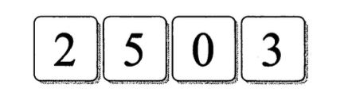

只是因为数位不同而意义不同：

- 2表示“1000的个数”
- 5表示“100的个数”
- 0表示“10的个数”
- 3表示“1的个数”

那么2503就应该是
$$
2 * 1000 + 5 * 100 + 0 * 10 + 3 * 1
$$
1000是 10X10X10，即 103(10的3次方)，100是 10X10，即 102(10的2次方〉,10 是 10 的 1 次方， 1 是 10 的 0 次方，因此也可以写成如下形式
$$
2*10^3 + 5 * 10^2 + 0 * 10^1 + 3 * 10^0
$$
我们可以看到千位、百位、十位、个位分别可以称作103、102、101、100位，10进制计数法的数位全是10n的形式，这个10称作10进制计数法的基数或底。

基数的右上角的数字，我们称为指数，是从右向左为0、1、2、3这样有规律的顺次排列的。

## 2进制计数法

### 什么是2进制计数法

计算机在处理数据时使用的是 2进制计数法

- 使用的数字只有，0、1，共2种，

- 从右往左分别表示1位、2位、4位、8位……

用 2进制计数法来数数，首先是 0，然后是 1，接下去不是2，而是在 1上面进位 变成10，继而是11， 100, 101...

### 分解 1100

 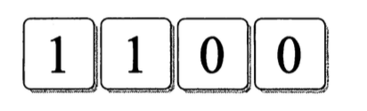
和 10进制计数法一样，并排的数字，各个数位都有不同的意义。从左往右依次为z

- 1表示“8的个数”
- 1表示“4的个数”
- 0表示“2的个数”
- 0表示“1的个数”

也就是说2进制的1100是1个8、 1个4、 0个2、和0个1累加的结果，即8 + 4 + 0 + 0 = 12 。
 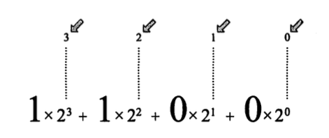

### 基数转换

​	如果把10进制中的12转换为2进制，只需要将12反复地除以2（12除以2，商为6；6再除以2，商为3；3再除以2……），并观察余数是“1”还是“0”，余数为0则表示除完了，随后再将每步所得的余数逆向排列，由此就得到2进制表示了。

 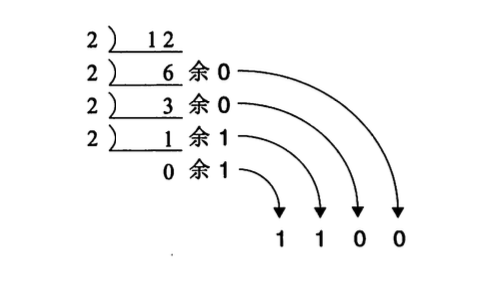

​	将 10进制的 2503转换为 2进制计数法。

 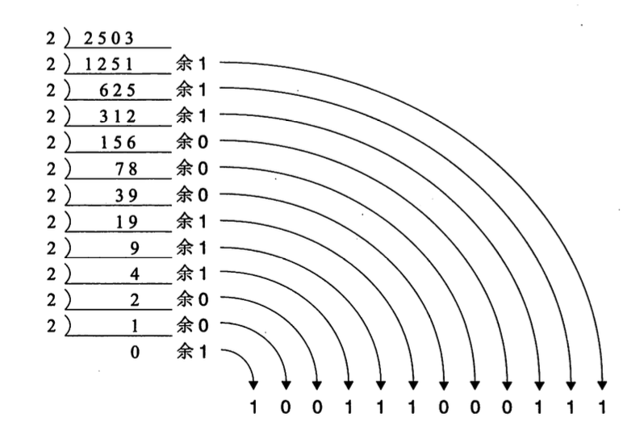

2503 用 2 进制表示为 100111000111。各个数位的权重如下：

 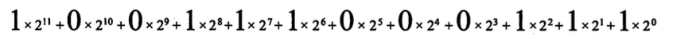

​	在 10进制中，基数为 10，各个数位是以lOn 的形式表现的。而 2进制中，基数为 2， 各个数位是以 T 的形式表现的。从 10 进制计数法转换为 2 进制计数法，称作 10 进制至 2 进制的基数转换。

### 计算机中为什么采用 2进制计数法

计算机在表示数的时候，会 使用以下两种状态。

- 开关切断状态 ... 0 
- 开关连通状态 ... 1

1个开关可以用0或1来表示，如果有许多开关，就可以表示为许多个 0 或 1。

### 总结一下

10进制和二进制的区别

- 在 10 进制计数法中，位数少，但是数字的种类多。 →对人类来说，这种比较易用。
- 在 2 进制计数法中，数字的种类少，但是位数多。 →对计算机来说，这种比较易用。

鉴于上述原因，计算机采用了 2进制计数法。

## 什么是按位计数法

在编程中，也常常使用 8进制和 16进制计 数法。

### 8 进制计数法

8 进制计数法的特征如下：

- 使用的数字有0、 1、 2、 3、 4、 5、 6、 7共8种。

- 从右往左分别为 
  $$
  8^0 的位、 8^1 的位、 8^2 的位、 8^3的位
  $$
  ......(基数是 8 )

### 16 进制计数法 

16进制计数法的特征如下：

- 使用的数字有0、 1、 2、 3、 4、 5、 6、 7、 8、 9、人民 C、 D、 E、 F共16种。 

- 从右往左分别为 
  $$
  16^0 的位、 16^1 的位、 16^2 的位、 16^3 的位
  $$
  ......(基数是 16 )

在 16进制计数法中，使用 A、 B、 C、 D、 E、 F (有时也使用小写字母 a、 b、 c、 d、 e、 f)来表示 10 以上的数字。

### N 进制计数法

一般来说 ， N进制计数法的特征如下：

- 使用的数字有01,2,3,...,N-1， 共N种。

- 从右往左分别为
  $$
  N^0 的位、 N^1 的位、 N^2 的位、 N^3 的位
  $$
  .....(基数是 N)

例如， N进制计数法中， 4位数a_3a2a向为
$$
α_3*N^3 +α_2*N^2+α_1*N^1+α_0*N^0 (a_3、a_2、a_1、a_0是0-N-1中的数字。〉
$$

## 指数法则

### 10的0次方是什么

任何数的0次方都等于1。

 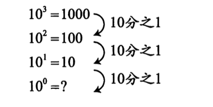

每当 10右上角的数字(指数〉减 1，数就变为原先的 10分之 1。因此， 10的0次方就是 1

### 10的-1次方是什么

 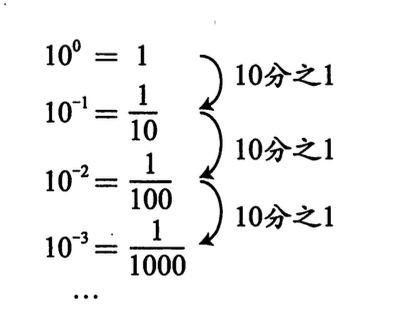

### 规则的扩展

​	对于所有的整数 n (...，一3， -2，一1， 0, 1, 2, 3，...)，都能定义10的n次方的值。 对于 10的-3 次方来说 ， "-3 个 10 相乘"的思维井不直观。但倘若套用扩展规则，即使 n 是负数，也能"定义出" 10的n次方的值。

### 对2的0次方进行思考

 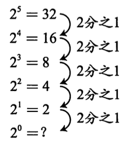

对于2的n次方来说来说 ，n 每减 1，数值就变成原来的 2 分之 1，2的1次方的2分之一是2的0次方，那么2的0次方等于1。

### 2的-1次方是什么

2的0次方除以2. 得到的是2的负一次方，即2分之一

同理， 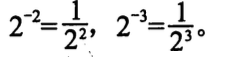

指数法则的表达式为
$$
N^a*N^b=N^a+^b
$$
即N的a次方乘以N的b次方，等于N的a+b次方法则〈但N≠O)。

 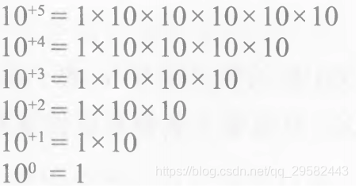

## 0所起的作用

### 1.占位

​	例如用10进制表示2503，这里面的0表示十位“没有”，虽说“没有”，但是这个0不能省略，如果省略了，就变成了253，那就是另一个数字了，在按位计数法中，数位具有很重要的意义，0的作用就是占着一个位置以保证数位高于它的数字不会产生错位。。

### 2.统一标准，简化规则

以2503举例，可以变成2 * 103 + 5 * 102 + 0 * 101 + 3 * 10 0 = 2503

如果没有规定N^0 = 1. 我们就必须特别处理“1”这个数字，0在这里起到了标准化的作用。