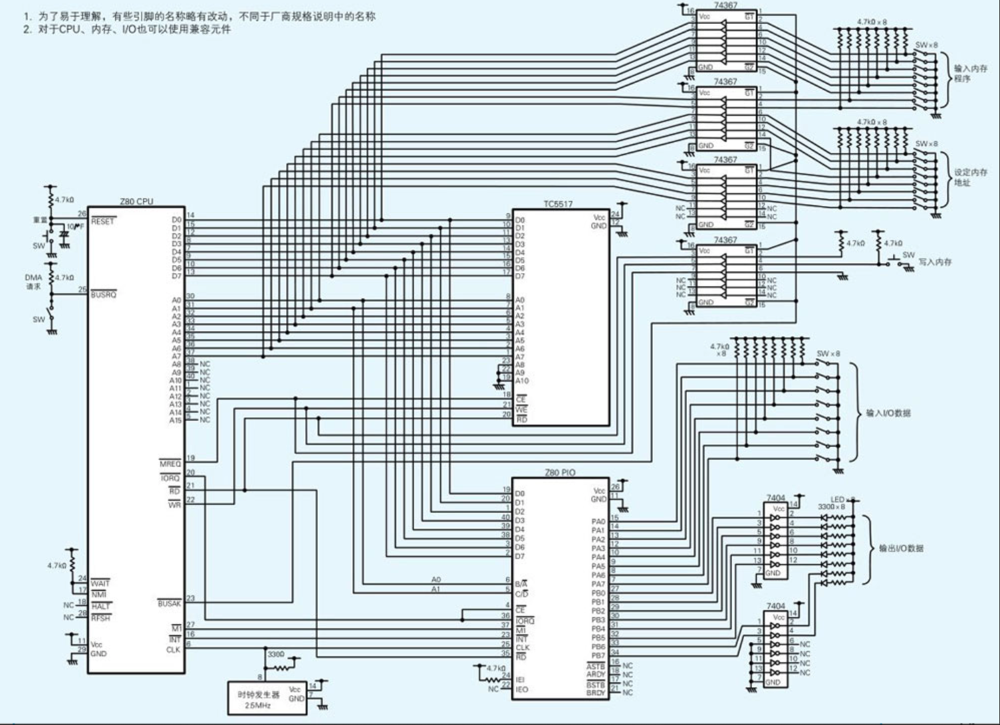
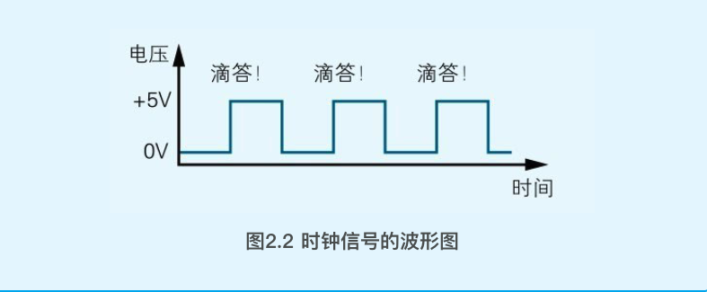
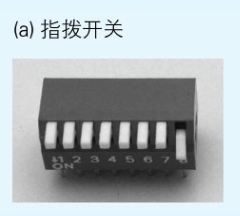
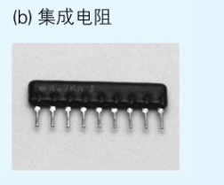
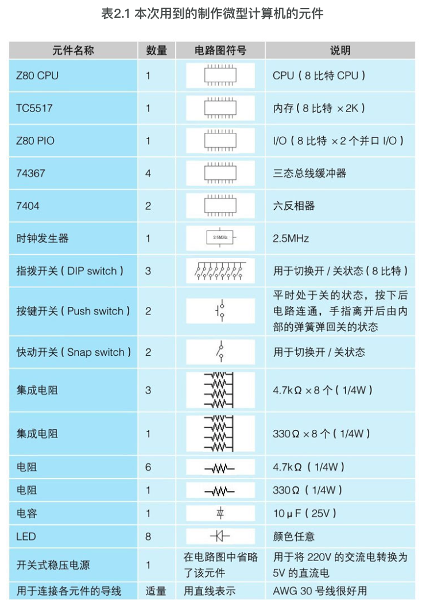
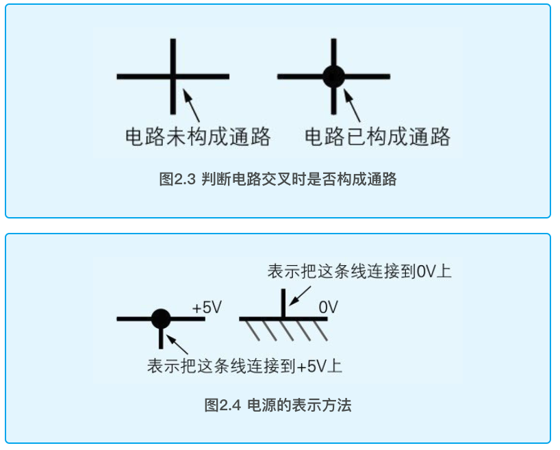
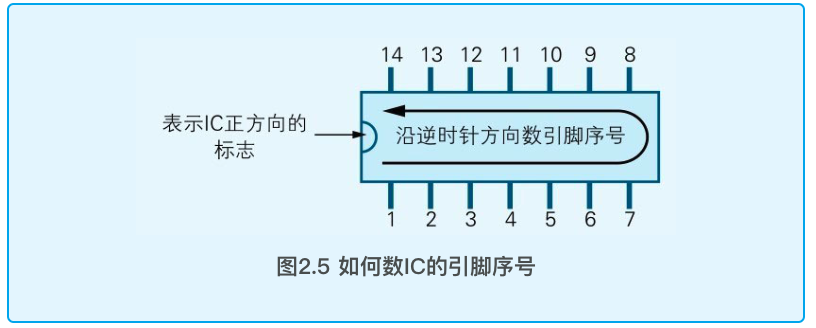

# 试着制造一台计算机吧

### CPU是什么的缩写？

​	CPU（Central Processing Unit，中央处理器）是电脑的核心部件，负责执行计算机程序。它是一种微型电子设备，能够快速进行数据处理和计算，并将处理结果存储在计算机的内存中。CPU 的主要功能是执行程序中的指令，包括进行数据的操作、控制其他部件的工作和跳转到其他程序的指令。

### Hz是表示什么的单位？

Hz（Hertz）是频率的单位，表示每秒钟的赫兹数。它可以用来表示电子设备的工作频率，例如 CPU 的主频、显卡的刷新率或声音的采样频率。1 Hz 相当于每秒钟发生一次事件，例如每秒钟转动一次、每秒钟产生一个电子脉冲或每秒钟产生一个声音信号。

### Z80 CPU是多少比特的CPU？

Z80 CPU是8比特的CPU。

CPU上数据总线的条数，或者CPU内部参与运算的寄存器的容量，都可以作为衡量CPU性能的比特数。在Z80 CPU中，无论是数据总线的条数还是寄存器的容量都是8比特，所以Z80 CPU是一款8比特的CPU。而在Windows个人计算机中广泛使用的Pentium（奔腾） CPU则是32比特的CPU。

## 2.1 制作微型计算机所必需的元件

​	制作微型计算机所需的基础元件只有3个，CPU、内存和I/O，CPU是计算机的大脑，负责解释、执行程序。内存负责存储程序和数据。I/O是Input/Output（输入/输出）的缩写，负责将计算机和外部设备（周边设备）连接在一起。

​	为了驱动CPU运转，称为“时钟信号”的电信号必不可少。这种电信号就好像带有一个时钟，滴答滴答地每隔一定时间就变换一次电压的高低。输出时钟信号的元件叫作“时钟发生器”。时钟发生器中带有晶振，根据其自身的频率（振动的次数）产生时钟信号。时钟信号的频率可以衡量CPU的运转速度。这里使用的是2.5MHz（兆赫兹）的时钟发生器。

 

​	用于输入程序的装置也是必不可少的。在这里我们通过拨动指拨开关来输入程序，指拨开关是一种由8个开关并排连在一起构成的元件（。输出程序执行结果的装置是8个LED（发光二极管）。

 

​	电阻是用于阻碍电流流动、降低电压值的元件。为了省去布线的麻烦，这里也会使用将8个电阻集成到1个元件中的集成电阻。电阻的单位是Ω（欧姆）。电容是存储电荷的元件，衡量存储电荷能力的单位是F（法拉）。要让微型计算机运转起来，5V（伏特）的直流电源是必不可少的。于是还需要使用一个叫作“开关式稳压电源”的装置，将220V的交流电变成5V的直流电。

 

 

## 2.2 电路图的读法

​	在电路图中，用连接着各种元件符号的直线表示如何布线。电路中有些地方有交叉，但若只是交叉在一起的话，并不表示电路在交叉处构成通路。只有在交叉处再画上一个小黑点才表示构成通路。

 

​	IC的引脚（所谓引脚就是IC边缘露出的像蜈蚣腿一样的部分）按照逆时针方向依次带有一个从1开始递增的序号。数引脚序号时，要先把表示正方向的标志，比如半圆形的缺口，朝向左侧。

 

​	如果按照引脚序号的排列顺序来画IC的电路图符号，那么标示如何布线时就会很不方便。所以通常所绘制的电路图都不受引脚实际排布的限制。画图时，在引脚的旁边写上引脚的序号，在表示IC的矩形符号中写上表明该引脚作用的代号。代号就是像RD（Read）表示执行读取操作，WR（Write）表示执行写入操作这样的代表了某种操作的符号。

## 2.3 连接电源、数据和地址总线